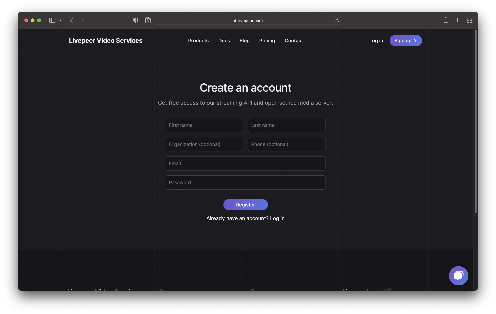
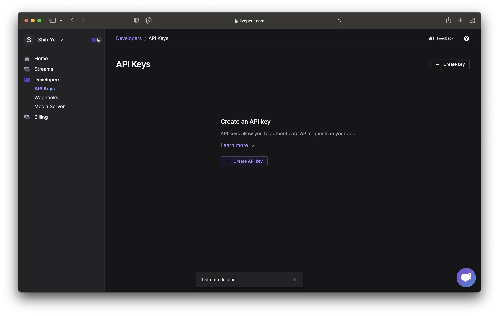
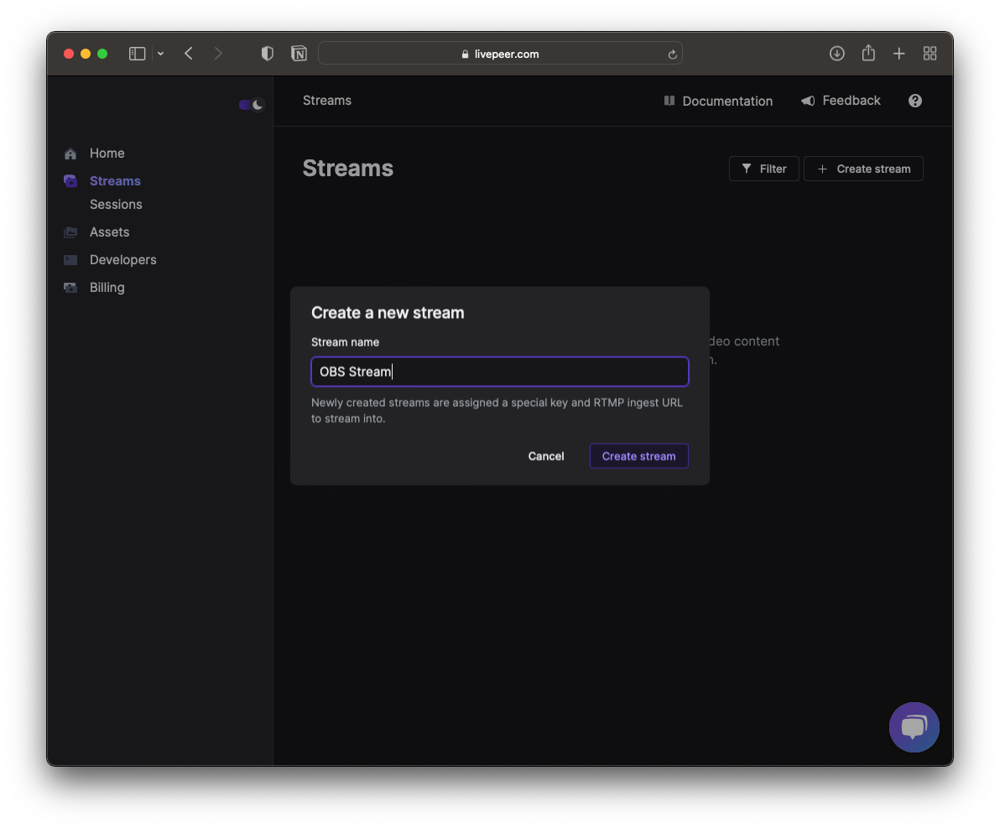
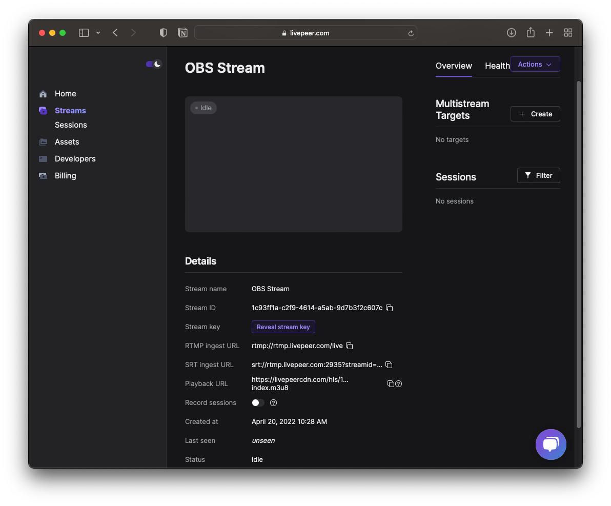
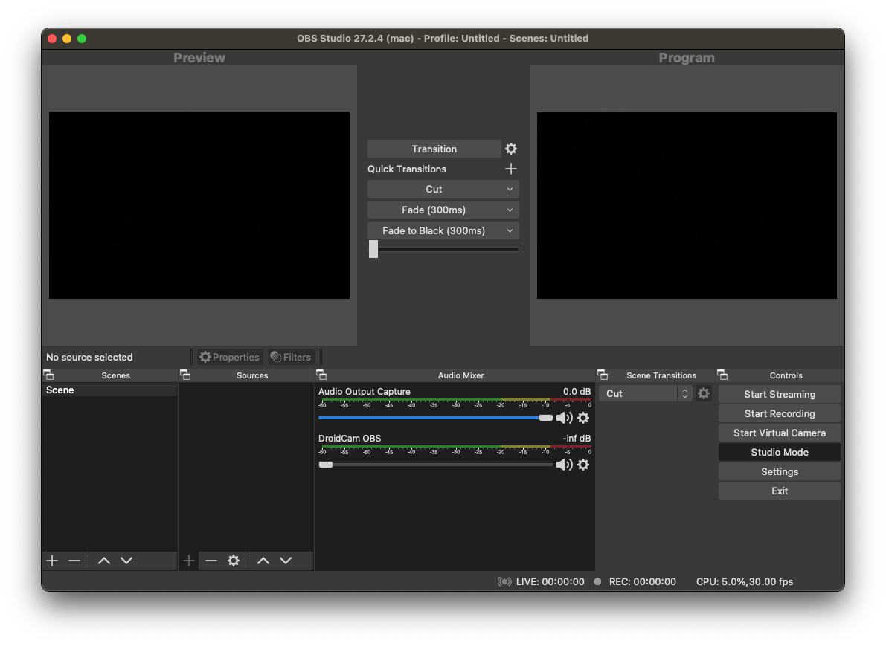
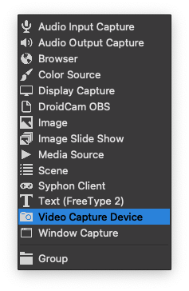
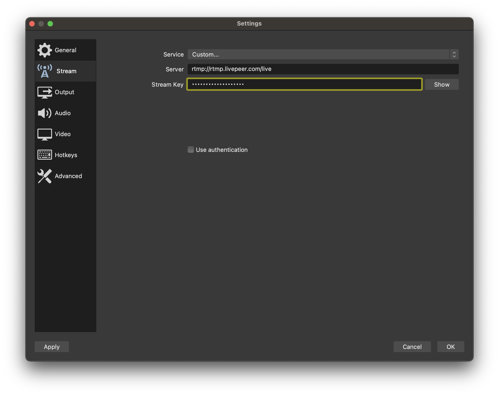
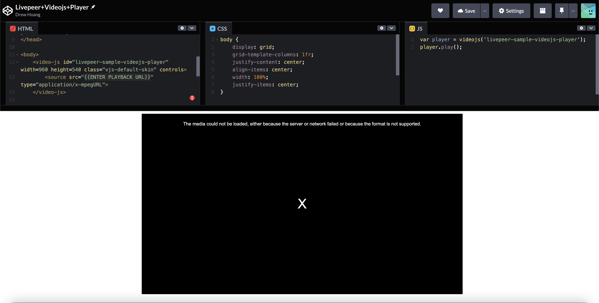

# How to build a Livepeer+Videojs  Player Tutorial
---

This tutorial will help guide users to setup a player using video.js and [Livepeer Video Services](https://livepeer.com/). 


### 📹 What is Livepeer? 📹
`Livepeer` is a decentralized video transcoding platform.

`Livepeer Video Services` makes adding video streaming features into your web3 apps easy. It can handle live streams or video files.

### What you need to get started:
* Register Livepeer.com Video Service Account
* Playback URL which should look like this: `https://livepeercdn.com/hls/a9346mwvhic21vtj/index.m3u8`
* [OBS](https://obsproject.com/) (Open Broadcaster System) or  [webrtmp SDK](https://github.com/livepeer/webrtmp-sdk) 


## How to build a player using just HTML, CSS, JavaScript

#### Step 1.  Register Livepeer Video Service Account and get API Key

* Create a free [Livepeer Video Service Account](https://livepeer.com/register)



* Create and name the API Key


* A modal should popup for you to enter your new stream 


* Click on `Create  Stream`  and your dashboard should look like:



#### 🎉 Amazing you setup your video service account 🎉
---
#### Step 2. Setup your Live Stream Feed

We will be using [video.js](https://videojs.com/) to view your livepeer video streams from [obs ](https://obsproject.com/) (Open Broadcaster System) or [webrtmp SDK](https://github.com/livepeer/webrtmp-sdk) 

* Start your stream using `OBS` or `webrtmp SDK` 

#### OBS: 

* Have `OBS` setup


* Go to sources box and click on the plus 
Select video capture device


* Make sure the source has the video capture device


* Select Stream settings
* Select `Custom` for services
* Copy and paste the RTMP ingest URL and Stream Key

    * RTMP ingest URL
    Example: `rtmp://rtmp.livepeer.com/live`

    * Stream key
    Example: `7d92-zrfi-tqki-lp0x`



* Click Start Streaming for the `OBS` 

#### Webrtmp SDK:
You can take a look at the [codepen](https://codepen.io/samuelmtimbo/pen/QWgaZGL)


#### 🎉 Amazing! You are now streaming LIVE! 🎉
---
#### Step 3. Add Video.js player with Livepeer PlayBack URL using HTML, CSS, JavaScript 
---
Warnings ⚠️

* ⚠️ Livepeer dashboard is to check your stream health 

* ⚠️ So we need to make a player so we can implement it into our own app. 

* ⚠️ Disclaimer: video will only display when you are active livestreaming
---

Check out our  [codepen](https://codepen.io/codentell/pen/XWVGwjV) full source code




The playback URL should look like this: `https://livepeercdn.com/hls/1fcae6n18ljto86h/index.m3u8` enter it in the src attribute

Example:
```html
<video-js id=example-video width=960 height=540 class="vjs-default-skin" controls>
    <source src="https://livepeercdn.com/hls/1fcae6n18ljto86h/index.m3u8" type="application/x-mpegURL">
</video-js>
```

#### How to build step-by-step

* Create a folder  for your project.
 Example: `livepeer-player-sample`

```bash
mkdir livepeer-player-sample
```


* Create an `index.html` inside the project folder
```bash
cd livepeer-player-sample
touch index.html
```

* Final code should look like this for implementing video.js with livepeer with the playback url

* Please replace the `{{ENTER YOUR PLAYBACK URL }}` with your own similiar to this: `https://livepeercdn.com/hls/1fcae6n18ljto86h/index.m3u8`
```html
<!DOCTYPE html>
<html lang="en">

<head>
    <meta charset="UTF-8">
    <meta name="viewport" content="width=device-width, initial-scale=1.0">
    <title>Video.js with Livepeer </title>
    <link href="https://vjs.zencdn.net/7.18.1/video-js.css" rel="stylesheet" />
</head>

<body>
    <video-js id="livepeer-sample-videojs-player" width=960 height=540 class="vjs-default-skin" controls>
        <source src="{{ENTER YOUR PLAYBACK URL}}" type="application/x-mpegURL">
    </video-js>

</body>
<script src="https://vjs.zencdn.net/7.18.1/video.min.js"></script>
<script src="https://unpkg.com/@videojs/http-streaming@2.14.2/dist/videojs-http-streaming.min.js"></script>
<script>
    var player = videojs('livepeer-sample-videojs-player');
    player.play();
</script>
</html>
```

#### 🎉 Amazing!  You added a Player! 🎉


### How to build a player using Next.js 
Coming Soon...


